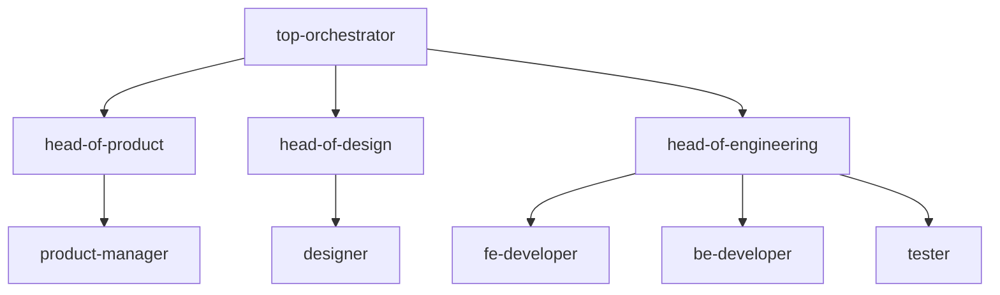

# Align Agent MD Files with Jira Workflow

## Architecture Change: Hierarchical Delegation

The delegation model changes from flat to hierarchical:




## Status Flow Reference

```
To Do -> Backlog -> Product Review -> Design Backlog -> Design Review -> Tech Backlog -> Code Review -> UAT -> Done -> Deployed
```

---

## File-by-File Changes

### 1. [top-orchestrator.md](.claude/agents/top-orchestrator.md)

**Tools change:**

- `Task(product-manager, fe-developer, be-developer, designer, head-of-engineering)` -> `Task(head-of-product, head-of-design, head-of-engineering)`

**Workflow rewrite** to match [jira-workflow.md](referances/jira-workflow.md) orchestrator responsibilities:

- Receives all agent updates across all statuses
- Maintains awareness of every task's current state
- Manages cross-team communication (product <-> design <-> engineering)
- Escalates to user when approval is required
- Spawns the correct head agent based on current Jira status:
  - Backlog -> head-of-product
  - Design Backlog -> head-of-design
  - Tech Backlog -> head-of-engineering
  - Done -> head-of-engineering (deployment)
  - UAT rejection -> head-of-engineering + head-of-product
- Add approval-required actions list
- Add inter-agent communication rules

---

### 2. [head-of-product.md](.claude/agents/head-of-product.md)

**Tools to add:**

- `mcp__jira__jira_transition_issue` (needed to move tasks: Backlog -> Product Review)
- `mcp__jira__jira_update_issue`

**Workflow updates:**

- Active in: **Backlog** status (primary), **UAT** (on rejection, validates AC)
- Spawns product-manager to write AC
- Reviews PM output, runs rejection loop if needed
- On approval: transitions task to **Product Review**
- Notifies `top-orchestrator` (not generic "lead")
- Add design-ready flag logic (PM writes AC for tech only when design is pre-provided)

---

### 3. [head-of-design.md](.claude/agents/head-of-design.md)

**Tools change:**

- Move `mcp__jira__jira_transition_issue` from disallowedTools to tools (needed: Design Backlog -> Design Review)
- Move `mcp__jira__jira_update_issue` from disallowedTools to tools

**Workflow updates:**

- Active in: **Design Backlog** status
- Standard flow: spawns designer to create specs
- Design-ready flow: spawns designer to review-only (no creation)
- Reviews designer output, runs rejection loop if needed
- On approval: transitions task to **Design Review**
- Notifies `top-orchestrator`

---

### 4. [head-of-engineering.md](.claude/agents/head-of-engineering.md)

**Tools change:**

- Move `mcp__jira__jira_transition_issue` from disallowedTools to tools (needed: Tech Backlog -> Code Review, Done -> Deployed)
- Move `mcp__jira__jira_update_issue` from disallowedTools to tools
- Add `mcp__github__merge_pull_request` (for deployment in Done status)

**Workflow updates:**

- Active in: **Tech Backlog** (primary), **Done** (deployment)
- Tech Backlog: architecture review, spawn FE/BE/tester in parallel, PR review, rejection loop
- On approval: transitions task to **Code Review**
- Done status: **MUST ask user for approval before deploying**, merge PR to main, verify Vercel deployment, post live URL as Jira comment, transition to **Deployed**
- Notifies `top-orchestrator`

---

### 5. [product-manager.md](.claude/agents/product-manager.md)

**Workflow updates:**

- Active in: **Backlog** status
- Add design-ready flag logic: if design already provided, write AC for tech team only (no design requirements)
- Change "Notify lead" -> "Notify head-of-product"
- Add: post AC and requirements as Jira comment for head-of-product review
- Clarify: write AC covering both design team and tech team requirements (unless design-ready)

---

### 6. [designer.md](.claude/agents/designer.md)

**Workflow updates:**

- Active in: **Design Backlog** status
- Add two explicit flows:
  - **Standard flow**: create component specs, design tokens, wireframes
  - **Design-ready flow**: review-only against design-system.md, no new creation
- Change "Notify lead" -> "Notify head-of-design"
- Add: follow design-system.md for all decisions
- Add: validate a11y compliance in design-ready flow

---

### 7. [fe-developer.md](.claude/agents/fe-developer.md)

**Workflow updates:**

- Active in: **Tech Backlog** status
- Add: read design specs from designer (in addition to AC)
- Change "Notify lead" -> "Notify head-of-engineering"
- Add: follow design specs and design-system.md

---

### 8. [be-developer.md](.claude/agents/be-developer.md)

**Workflow updates:**

- Active in: **Tech Backlog** status
- Change "Notify lead" -> "Notify head-of-engineering"

---

### 9. [tester.md](.claude/agents/tester.md)

**Workflow updates:**

- Active in: **Tech Backlog** status (in parallel with developers)
- Clarify: reports to head-of-engineering (already there, just make explicit in workflow)
- Add: runs in parallel with FE/BE developers

---

### 10. [CLAUDE.md](CLAUDE.md)

**Routing section:**

- Update to reference head agents as entry points instead of leaf agents

**Spawn Order section:**

- Rewrite to match hierarchical flow:
  1. Backlog: top-orchestrator -> head-of-product -> product-manager
  2. Design Backlog: top-orchestrator -> head-of-design -> designer
  3. Tech Backlog: top-orchestrator -> head-of-engineering -> fe-dev/be-dev/tester
  4. Done: top-orchestrator -> head-of-engineering (deployment)

**Agent Teams section:**

- Update inter-agent communication to match jira-workflow.md communication rules
- Add API contract flow: BE -> Jira comment + mailbox -> FE (coordinated by head-of-engineering)
- Add design handoff flow: designer -> Jira comment + mailbox -> FE (coordinated by head-of-design)

