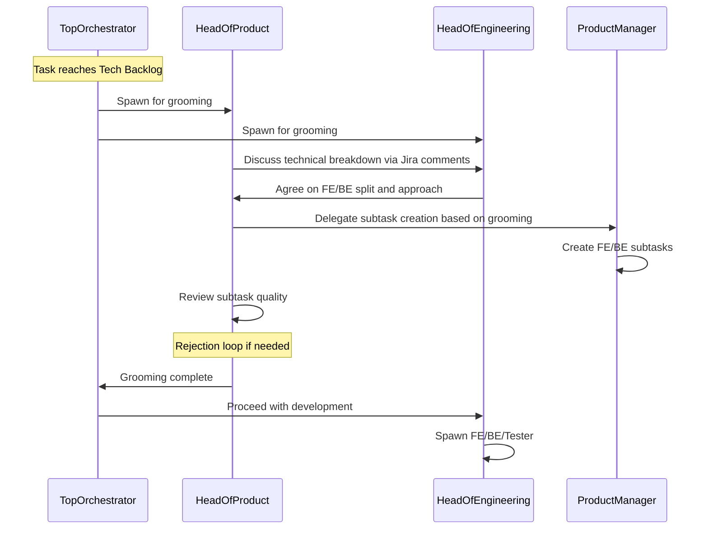

# Grooming Session at Tech Backlog

## What Changes

Currently, `product-manager` creates `[FE]`/`[BE]` subtasks during the Backlog phase — before the task has even been through Product Review or Design Review. This means:

- Human reviewers see implementation subtasks alongside the `[Product Definition]` subtask (noisy)
- Engineering breakdown happens before design is finalized (premature)

**New approach:** `[FE]`/`[BE]` subtasks are created at the START of Tech Backlog, after a grooming session between product and engineering.

## Grooming Flow

## File Changes

### 1. [product-manager.md](.claude/agents/product-manager.md)

- **Remove** `[FE]`/`[BE]` subtask creation from the Backlog workflow (step 5 currently)
- **Remove** `[FE]` and `[BE]` from the subtask prefix rule in the Backlog phase
- **Add** new section: "Grooming Phase (Tech Backlog)" — PM creates `[FE]`/`[BE]` subtasks when spawned by head-of-product during grooming
- **Update** "Active in" from just `Backlog` to `Backlog, Tech Backlog (grooming)`
- Keep the API contract comment step (step 6 currently) — this moves to grooming as well

### 2. [head-of-product.md](.claude/agents/head-of-product.md)

- **Add** new section: "Workflow (Tech Backlog — Grooming)"
  - Collaborate with head-of-engineering to define technical breakdown
  - Post grooming decisions as Jira comment
  - Spawn product-manager to create `[FE]`/`[BE]` subtasks
  - Review subtask quality (match grooming decisions)
  - Rejection loop: feedback to PM if subtasks don't match agreement
  - Notify top-orchestrator when grooming is complete
- **Update** "Active in" to include `Tech Backlog (grooming)`
- **Add** grooming subtask quality checks to the Quality Gate Checklist

### 3. [head-of-engineering.md](.claude/agents/head-of-engineering.md)

- **Update** Tech Backlog workflow — add grooming as the FIRST step before spawning developers:
  - Step 1 becomes: collaborate with head-of-product on technical breakdown
  - Post architecture decisions and FE/BE split as Jira comment
  - Wait for product-manager to create subtasks and head-of-product to approve
  - THEN spawn developers using the approved subtasks
- The existing architecture review merges naturally with the grooming step

### 4. [top-orchestrator.md](.claude/agents/top-orchestrator.md)

- **Update** Tech Backlog delegation: spawn BOTH head-of-product and head-of-engineering for grooming first
- **Add** grooming awareness: developers should not be spawned until grooming is complete and subtasks exist
- Update the Status-Based Delegation table for Tech Backlog

### 5. [referances/jira-workflow.md](referances/jira-workflow.md)

- **Update** Backlog section: remove [FE]/[BE] subtask creation from product-manager responsibilities
- **Update** Tech Backlog section: add grooming step at the beginning, before developer spawn
- **Add** new subsection: "Grooming Session" rules — who participates, what they produce, quality gate
- **Update** Quick Reference: Agent -> Status Mapping to show product-manager and head-of-product active in Tech Backlog (grooming)

### 6. [CLAUDE.md](CLAUDE.md)

- **Update** Spawn Order for Tech Backlog: note that grooming happens first (head-of-product + head-of-engineering), then developers
- Minor wording update to clarify subtask creation timing

